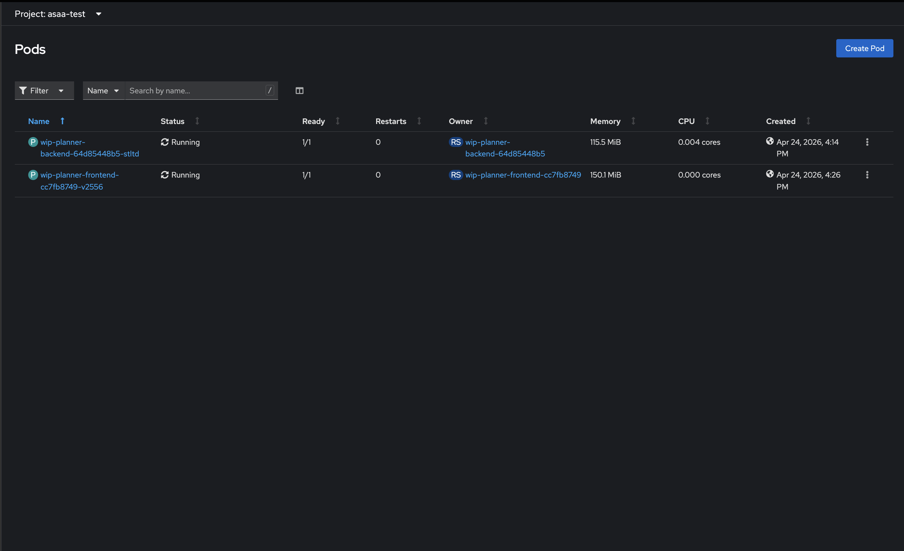
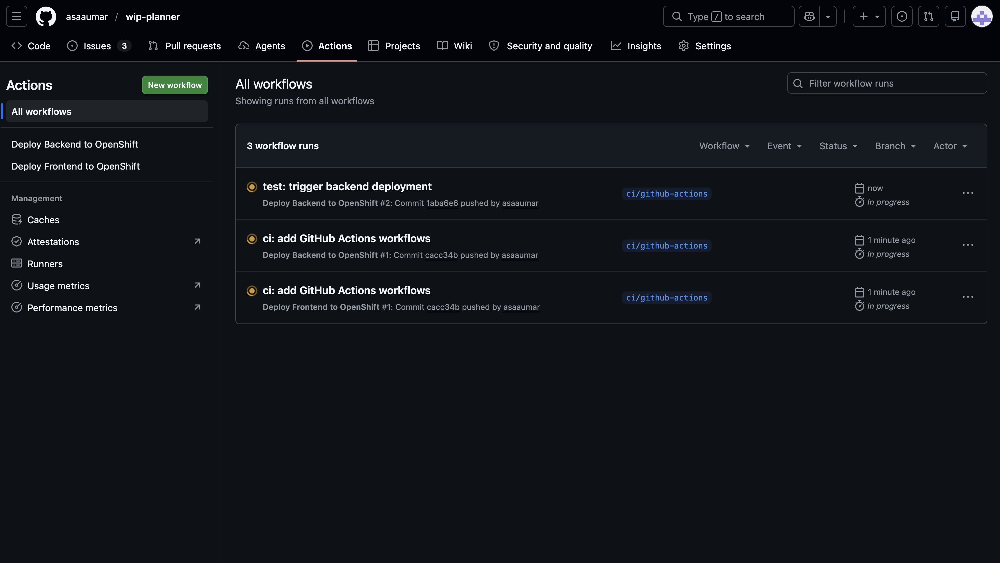
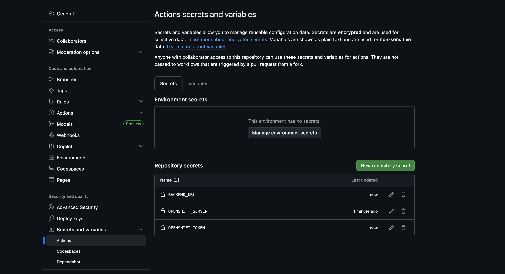

# WIP Planner

## MVP statement
 A web-based Kanban board with enforced Work-In-Progress limits, built with FastAPI (Python) and a JavaScript frontend, including tests, CI/CD, and Kubernetes deployment.

 LINK TO GITHUB: https://github.com/asaaumar/wip-planner

## 1. Product proposal

### 1.1 Problem statement
Software delivery teams working in short, timeboxed cycles frequently encounter a predictable pattern: work is started quickly, but completion and validation lag behind. Under delivery pressure, teams may initiate multiple items in parallel to appear responsive, but this can be distracting and increase context switching. From a flow-based perspective, the result is often an accumulation of partially completed work in “in progress” states, while activities that prove completeness such as integration and end-to-end testing are deferred (Anderson, 2010). This creates a false positive of productivity which does not reflect the true completed tickets for the sprint. 

High work-in-progress (WIP) is problematic because it hides bottlenecks and makes it harder to identify the true constraint in the system or team. When WIP is unconstrained and unmonitored, delays are not made visible as a problem as they appear in progress and not blocked. This increases lead times and creates uneven delivery between sprints where tasks remain partially complete across multiple cycles and must be re assessed repeatedly (Anderson, 2010). Agile methods aim to reduce waste and deliver working increments frequently, but these outcomes depend on disciplined work management; without explicit flow controls, teams can inadvertently optimise for starting rather than finishing (Beck et al., 2001). In addition, teams often lack a mechanism to signal when “in progress” is saturated and should not be expanded further-especially in environments where external stakeholders have visibility of wip and there may be a pressure to appear busy.

As mentioned above, this problem is amplified in client-facing or high-accountability contexts where delivery credibility depends not only on activity, but on demonstrable outcomes through playbacks. If work resource is spread too thin or an engineer is aligned to too many tickets due for completion, teams may miss opportunities to  demonstrate value, validate behaviour end-to-end (testing), and produce evidence that a feature is “done” in a meaningful sense in front of a client. Subsequently, stakeholders may request additional proof, rework, or changes late in the cycle, further increasing churn. A lightweight mechanism that improves flow discipline and makes constraints explicit can therefore support both delivery performance and stakeholder confidence.

### 1.2 Solution proposal and rationale
The proposed solution is a lightweight web-based WIP Planner: a minimal Kanban board that makes work state visible and enforces a Work-In-Progress limit to encourage completion before taking on more tasks. The application provides a three-column workflow (Backlog, In Progress, Done) and prevents users from having too many tickets in the “In Progress” column by enforcing a configurable WIP limit (default = 1). The proposal rationale follows modern Kanban practices: limiting WIP is a central mechanism for stabilising flow, reducing context switching, and surfacing bottlenecks early (Anderson, 2010). Rather than relying on informal self-control.

The design intentionally avoids complexity. Many task management tools similar to the proposed often focus on being feature-rich, but feature depth is not the primary requirement for improving flow and therefore ot the scope for the project. Instead, the WIP Planner focuses on a small set of actions that support the core behavioural change: capturing work clearly, starting only what can be completed (enforced by WIP), and making exceptions visible (ticket in progress for too long). This aligns with the Agile principle of prioritising working, inspectable outcomes and reducing process overhead that does not contribute to value (Beck et al., 2001). The solution also supports clear feedback at the point of action: when a user attempts to move an item into “In Progress” and the WIP limit has been reached, the system provides immediate feedback and blocks the move. This creates a consistent rule set that reduces ambiguity and helps users understand why flow discipline matters in practice.

Additionally, a minimal three-state (columns) workflow drives interpretability; users can quickly understand the meaning of each state/column and the expectations attached to it. This is particularly useful in short-cycle delivery (such as daily or weekly sprints) where teams need a common model of “what is happening” without investing time in maintaining process artefacts and admin. The proposal therefore prioritises usability and clarity over sophistication, while still providing enough structure to demonstrate professional advanced software engineering practice in implementation, testing, CI/CD, deployment and documentation.

### 1.3 Target users and value proposition
The primary target users for the project are small software delivery teams (or individuals) operating in short cycles (weekly or daily sprints) who need clearer visibility of progress and a simple way of preventing over burdoning engineers. A key point of note is that the value proposition is not that the tool replaces established enterprise platforms (such as monday.com), but that it provides an intentionally constrained workflow to reinforce good flow habits and can be used as an informal tracker/training tool. For teams, the tool offers: improved transparency of work state reduced hidden work caused by excessive parallelism (such as integration testing) and a clearer pathway to producing demonstrable increments with completed tickets tracked in "Done". For individuals, the tool acts as a self-management/training aid which enforces behaviour that aligns with the mentality that finishing tasks is often more valuable than starting additional ones (team culture).

The educational value of the tool is that it is designed to make flow concepts digestible. By enforcing a WIP limit and presenting clear feedback, it helps users connect abstract ideas such as WIP, bottleneck and throughput to behaviour. This provides a strong basis for evaluating whether WIP limits improve completion within time constraints and how different limits can affext sprint deliverables.

### 1.4 MVP scope
The MVP is deliberately scoped to address the issues in the problem statement while remaining deliverable within the assessment timeline.

1. A three-column board: Backlog, In Progress, Done
2. Task management: create, edit, delete tasks (title required; description optional)
3. Status transitions between columns (button-based movement)
4. WIP limit enforcement on “In Progress” (default limit = 1) with clear error feedback when exceeded
5. Persistence so tasks remain available between sessions (stored and reloaded automatically)

### 1.5 Non-MVP scope (stretch goals)
To prevent scope creep, the following features are explicitly out of scope for the MVP:
- Drag-and-drop interactions (buttons are sufficient and reduce accessibility risk)
- Authentication, user accounts, and multi-user permissions
- Advanced analytics (cycle time dashboards, forecasting)
- Integrations with external platforms (e.g., Jira/Slack)
- Complex workflow configurations beyond three core states

### 1.5. Data Model/API Contract
The core data model for functionality in the WIP Planner is as follows:

```json
{
  "id": "string (UUID)",
  "title": "string",
  "description": "string (optional)",
  "status": "string (enum: 'todo', 'in-progress', 'done')",
  "created_at": "string (ISO 8601 datetime)",
  "updated_at": "string (ISO 8601 datetime)"
}
```

#### Field Descriptions

| Field | Type | Required | Description |
|-------|------|----------|-------------|
| `id` | string (UUID) | Yes | Unique identifier for the task |
| `title` | string | Yes | Task title (max 200 characters) |
| `description` | string | No | Detailed task description |
| `status` | enum | Yes | Current status: `todo`, `in-progress`, or `done` |
| `created_at` | ISO 8601 datetime | Yes | Timestamp when task was created |
| `updated_at` | ISO 8601 datetime | Yes | Timestamp when task was last updated |

#### Validation Rules

- `title`: Required, non-empty, max 200 characters
- `status`: Must be one of: `todo`, `in-progress`, `done`
- `description`: Optional, max 2000 characters

#### Error Response Format

All API errors return a consistent format that maps to UI error toasts/modals:

```json
{
  "error": {
    "code": "string",
    "message": "string",
    "field": "string (optional)",
    "details": "object (optional)"
  }
}
```

Example Error Response:
```json
{
  "error": {
    "code": "VALIDATION_ERROR",
    "message": "Task title is required",
    "field": "title"
  }
}
```

#### Common Error Codes

| Code | HTTP Status | Description |
|------|-------------|-------------|
| `VALIDATION_ERROR` | 400 | Invalid input data |
| `NOT_FOUND` | 404 | Task not found |
| `WIP_LIMIT_EXCEEDED` | 409 | Work-in-progress limit reached |
| `INTERNAL_ERROR` | 500 | Server error |

#### REST API Endpoints

Task Endpoints:
- `GET /tasks` - List all tasks
- `POST /tasks` - Create a new task
- `GET /tasks/{id}` - Get a specific task
- `PUT /tasks/{id}` - Update a task
- `DELETE /tasks/{id}` - Delete a task
- `PATCH /tasks/{id}/status` - Update task status (with WIP limit enforcement)

Settings Endpoints:
- `GET /settings/` - Get current WIP limit settings
- `PUT /settings/` - Update WIP limit

## 2. UX prototype (Figma)

The UX prototype was designed to validate the core interaction model of the WIP Planner and is designed to allow users users to be able to: View work state through a single pane of glass, create and maintain tasks with minimal friction and effort and receive immediate, understandable feedback when attempting to exceed the Work-In-Progress (WIP) limit in line with the mvp scope and problem statement. The design uses a single primary screen which is the Kanban board and a set of modal dialogues for secondary actions (create, edit, delete confirmation, settings, and WIP error)(figure 1). This pattern reduces navigation complexity and keeps users anchored in the board context, which supports task management workflows and lowers cognitive load (Nielsen, 1994; Shneiderman et al., 2016).


### 2.1 Prototype structure and interaction model
The Kanban board is the main workspace and is organised into three columns: Backlog, In Progress, and Done. This supports the findings of modern research around recognition over recall by making state visible and reducing the need for users to remember where work “should be” (Nielsen, 1994) with the board acting as the source of truth. Task cards display the task title and task description, with action buttons on each card to reduce interaction effort.

All secondary actions are implemented as pop up modals, which ensure users do not lose context or need to navigate away from the board (to other screens) to perform actions (Shneiderman et al., 2016). The modals are context-specific and appear only when needed, minimizing cognitive load. The Modals are as follows:
- Create Task: opens the create modal from the “New Task” button.
- Edit Task: opens the edit modal from the task's edit control.
- Delete Task triggers a delete confirmation modal to prevent accidental destructive actions within the edit modal.
- Settings opens a settings modal to modify the WIP limit.
- WIP Limit Exceeded opens an error modal when the user attempts to move a task into In Progress and the WIP rule would be breached.

This modal-based pattern provides clear interaction boundaries and supports safe task completion by reducing the number of screens the user must traverse (Nielsen, 1994). To ensure the interaction was well defined, prototyping was used in Figma to test the design layout (figure 2)


### 2.2 Key UX decisions and justification
#### Three column structure
The three column workflow has been designed intentionally to promiote interpretability and speed over configurability. For an MVP, this reduces the effort required for onboarding/upskilling and therefore supports rapid adoption by aligning the interface with a familiar mental model of "to do / doing / done" (Shneiderman et al., 2016). The In Progress column explicitly displays the WIP limit, reinforcing the system’s primary goal.

#### WIP limit enforcement 
When a user attempts to move a task into "In Progress" and it exceeds the limit defined for that column, the prototype presents a dedicated “WIP Limit Exceeded” warning. This supports visibility of system status and error prevention by explaining why the action cannot be completed and what the user should do next through an eror message (complete a task before starting another) (Nielsen, 1994). Presenting this feedback immediately reduces ambiguity and discourages workarounds that would undermine flow discipline such as moving a task to backlog to start another.

#### Task creation and editing
The create and edit modals use a minimal set of fields (title required; description optional). This supports research into the area of project management that overly complex capture forms reduce compliance and increase the likelihood of informal “shadow tracking” outside the tool (Ries, 2011).

#### Destructive action protection
Deletion functionality is designed to be completed through a dedicated confirmation modal, reducing the risk of accidental data loss. This reflects a defensive design approach and supports error prevention principles (Shneiderman et al., 2016).

#### Interaction choices (buttons vs drag-and-drop)
Status/column transitions are designed as button actions rather than drag-and-drop. While drag-and-drop can feel intuitive, it is often harder to implement accessibly and reliably across devices without additional design and engineering effort. Button-based transitions provide clearer usability and can be labelled explicitly, the intial design of this project featured one button but future implementation led to 2 buttons (one right and one left), supporting accessibility expectations around operable interfaces and clear controls (W3C, 2023). This decision also reduces engineering risk within a short delivery window, while maintaining functional clarity.

Overall, the prototype is minimal and designed to prove value and feasbility as it demonstrates the end-to-end user journey, makes the WIP constraint visible and enforceable, and keeps interaction cost low. This provides a strong harness for evaluating whether the WIP enforcement design achieves the desired behavioural outcome while remaining usable in delivery contexts (Anderson, 2010).

## 3. Project planning (Kanban board + tickets)

Project planning for the WIP Planner was managed using a Kanban-style workflow in GitHub Projects to support visibility and traceability. Kanban was selected as the project tasks are a set of small, testable work items (created as issues). The board functions as a planning tool and an execution tool.

### 3.1 Board structure and workflow states
The project board uses five columns: Backlog, Ready, In Progress, In Review, and Done.

- Backlog contains tasks that are not yet ready to start.
- Ready acts as a preparation zone for tasks that are ready to be worked on. This allows me to review and refine tasks before they enter development and plan what is to be done next.
- In Progress contains tasks actively being implemented. Work is intentionally kept low in this column to reduce context switching and increase the probability that tasks reach a demonstrable “done” state within the timebox (Anderson, 2010). To match the short timeframe of this build related tickets were allowed to be in progress at once.  
- In Review is used for work that is implemented but awaiting verification. This column was intended to be used for merge requests before they are merged to main however due to me being the only member of the team this was seen as redundant. 
- Done represents work that is merged into `main` and completes the issue.

### 3.2 Ticketing approach and traceability
Work was deconstructued into small issues mapped to the MVP scope: backend persistence and CRUD, WIP settings, WIP enforcement on status transitions, frontend board UI and API integration testing, k8s, ci and docs.

Execution evidence is captured through a PR-first workflow. Each feature was implemented on a branch and merged via a pull request linked to the relevant issue(s). PR descriptions include a summary of changes. This approach also supports the Agile tenat incremental integration which states smaller PRs reduce merge risk and make it easier to identify regressions compared with large changes (Beck et al., 2001).

Links and evidence:
- See [section 4](#4-mvp-implementation-overview) for a list of features, PRs and evidence of the kanban board state associated with these PRs.

## 4. MVP implementation overview

### Build log (academic implementation narrative)

The implementation of this project was delivered iteratively over a 1 week sprint. The following log captures the tangible outcomes of each day:

#### Day 1 (Setup & scaffolding)
- Created repo structure (`backend/`, `frontend/`, `docs/`, `k8s/`) and initial README headings for traceability.
- Bootstrapped FastAPI with `/health` for smoke checks and early verification.
- Bootstrapped frontend (react JS)

- Created GitHub Projects board and initial issues to track delivery.
- [PR #15: chore: day 1 scaffold backend/frontend and README](https://github.com/asaaumar/wip-planner/pull/15)
- Kanban board state: 
- 

#### Day 2 (UX prototype & API Contract)
- Produced a clickable Figma prototype using a single-board view with pop up modals (create/edit/delete/settings/WIP error).
- Defined the MVP API contract (tasks + settings endpoints)
- Figma evidence in: screenshots (`docs/screenshots/`) and prototype video (`docs/videos/`).
- [PR #19: feature: add SQLite persistence and task model](https://github.com/asaaumar/wip-planner/pull/19)
- Kanban board state: 
- 

#### Day 3 (Backend persistence + CRUD + test harness)
- Implemented SQLite persistence and Task model to store tasks across sessions.
- Added CRUD endpoints: `GET/POST/PUT/DELETE /tasks` and verified via FastAPI interactive docs.

- Added `GET/PUT /settings` for WIP limit configuration.


- Added pytest harness + initial smoke test to support tdd work.
- [PR #19: feature: add SQLite persistence and task model](https://github.com/asaaumar/wip-planner/pull/19)
- [PR #20: feature: implement task CRUD endpoints](https://github.com/asaaumar/wip-planner/pull/20)
- [PR #21: Feature: added get specific task endpoint](https://github.com/asaaumar/wip-planner/pull/21)
- [PR #23: feature: add settings endpoints for WIP limit](https://github.com/asaaumar/wip-planner/pull/23)
- [PR #24: test: add pytest scaffold and health endpoint test](https://github.com/asaaumar/wip-planner/pull/24)
- Kanban board state: 
- 


#### Day 4 (WIP rule + status transitions with TDD)
- Added `PATCH /tasks/{id}/status`.
- 
- Implemented WIP enforcement when moving to `IN_PROGRESS`; returns `409` with structured error when limit exceeded.


- Added unit tests using a TDD sequence (write test, watch test fail, write code to pass test, watch test pass) for the WIP rule enforcement.
- [PR #26: test: add failing tests for WIP rule (TDD), feat: implement WIP rule to satisfy tests](https://github.com/asaaumar/wip-planner/pull/26)
- [PR #27: test: written tests for checking wip limit when changing status, feature: added patch endpoint to change status,wrote code to pass wip enforcement tests](https://github.com/asaaumar/wip-planner/pull/27)
- Kanban board state: 
- 

#### Day 5 (Frontend integration + error UX + containerisation)
- Implemented 3-column Kanban UI and connected to backend (load + create tasks).
- 
-
- Added button-based status transitions and UI handling for `409 WIP_LIMIT_EXCEEDED` responses.

- Added settings modal to update WIP limit via `/settings`.


- Added edit task modal

- Added Dockerfiles for backend and frontend to enable reproducible builds and deployment.
- [PR #32:feature: add frontend kanban board layout](https://github.com/asaaumar/wip-planner/pull/32)
- [PR #33: feature: connect frontend to backend (load and create tasks) with WIP enforcement](https://github.com/asaaumar/wip-planner/pull/33)
- [PR #35: feature: added settings modal to change WIP](https://github.com/asaaumar/wip-planner/pull/35)
- [PR #36: k8s: added Dockerfile and dockerignore](https://github.com/asaaumar/wip-planner/pull/36)
- 
- 
- 

#### Day 6 (Documentation)
- Expanded README sections to document UX decisions, API contract, implemented features, and evidence (PRs, screenshots).

#### Day 7 (Deployment yamls + OpenShift)
- Wrote Kubernetes/OpenShift manifest YAMLs and deployed the final version to OpenShift.
- 
- Added CI through github actions to redploy on PR merge.
- 
- Completed user and technical documentation (local run + deployment steps).
- [PR #41: k8s: added deployment manifests for front end, k8s: added deployment manifests for backend, fix: made changes to apps to work with eachother ink8s env](https://github.com/asaaumar/wip-planner/pull/41)
- [PR #42: ci: add GitHub Actions workflows, test: trigger backend deployment, ci: changed files to watch main after testing](https://github.com/asaaumar/wip-planner/pull/42)
- 
- 

## 5. TDD Example: WIP Limit Enforcement

Test-Driven Development (TDD) was used to implement the WIP limit enforcement logic. This section describes the TDD cycle used to build the `can_move_to_in_progress` function, which determines whether a task can be moved to "In Progress" based on the WIP limit.

### 5.1 TDD Approach and Rationale

TDD was selected for the WIP enforcement feature because:
- The WIP rule has well-defined inputs (current count, limit) and outputs (allow/block)
- WIP enforcement is the primary goal for the project
- Multiple boundary conditions needed explicit testing (at limit, below limit, zero limit)

The TDD cycle followed Red-Green-Refactor pattern:
- Red: Write a failing test that defines desired behaviour
-Green: Write minimal code to make the test pass
- Refactor: Improve code quality while keeping tests green

### 5.2 Test Suite: Unit Tests for WIP Logic

The unit tests focus on the pure business logic in isolation, testing the `can_move_to_in_progress` function with various inputs:

Test Cases:
- Allow when count < limit - Verifies tasks can move when under capacity (0 < 1)
- Allow when just below limit - Tests boundary condition (2 < 3)
- Block when count == limit - Enforces limit at exact capacity (1 == 1)
- Block when count > limit - Handles over-capacity scenarios (3 > 2)
- Block when limit is zero - Edge case: no tasks allowed (0 >= 0)
- Block with zero limit and positive count - Validates zero limit blocks all (5 >= 0)

Each test follows the Arrange-Act-Assert pattern.

Example Test (Red Phase):
```python
def test_block_when_count_equals_limit(self):
    """Should block moving to in-progress when count == limit"""
    # Arrange
    in_progress_count = 1
    wip_limit = 1
    
    # Act
    result = can_move_to_in_progress(in_progress_count, wip_limit)
    
    # Assert
    assert result is False, "Should block when count (1) == limit (1)"
```

### 5.3 Implementation: WIP Service (Green Phase)

After writing failing tests, the minimal implementation was created in `app/services/wip.py`:

```python
def can_move_to_in_progress(in_progress_count: int, wip_limit: int) -> bool:
    """
    Check if a task can be moved to in-progress status
    
    Args:
        in_progress_count: Current number of tasks in progress
        wip_limit: Maximum allowed tasks in progress
        
    Returns:
        True if task can be moved to in-progress, False otherwise
    """
    return in_progress_count < wip_limit
```

This implementation satisfies all test cases.

### 5.4 Integration Tests: End-to-End WIP Enforcement

Integration tests were written to ensure the WIP rule works correctly throughout the backend, including:
- Database interactions
- HTTP request/response handling
- Status transitions via the `PATCH /tasks/{id}/status` endpoint
- Error responses (409 Conflict) when WIP limit is exceeded

Key Integration Test Scenarios:
- Create a task and move it to in-progress successfully
- Creates two tasks, moves first to in-progress, block second (409 response)
- Verify WIP check only applies to in-progress transitions
- Confirm moving back to backlog bypasses WIP check

Example Integration Test:
```python
def test_blocks_moving_to_in_progress_when_at_limit():
    """Should block moving to in-progress when at WIP limit"""
    # Create two tasks
    response1 = client.post("/tasks/", json={"title": "Task 1"})
    task1_id = response1.json()["id"]
    
    response2 = client.post("/tasks/", json={"title": "Task 2"})
    task2_id = response2.json()["id"]
    
    # Move first task to in-progress (should succeed)
    response = client.patch(f"/tasks/{task1_id}/status",
                           json={"status": "in-progress"})
    assert response.status_code == 200
    
    # Try to move second task to in-progress (should fail, 1 >= 1)
    response = client.patch(f"/tasks/{task2_id}/status",
                           json={"status": "in-progress"})
    assert response.status_code == 409
    assert "WIP_LIMIT_REACHED" in str(response.json())
```

### 5.5 TDD Benefits

The TDD approach provided several benefits:

- All edge cases are explicitly tested, reducing the risk of bugs in production
- Tests document the expected behaviour of the WIP rule for future development
- The test suite allows for refactoring without breaking functionality
- Unit tests run fast, enabling rapid iteration (no need to spin up an instance and test)
- Writing tests first led to a cleaner separation between business logic (WIP service) and infrastructure (API router, database)

## 6. UI Implementation and Evaluation

### 6.1 Accessibility and Usability Assessment

The WIP Planner UI was implemented with accessibility and usability as core considerations, following WCAG 2.2 guidelines and established HCI principles.

#### Visual Clarity and Perceivability
The three-column layout provides visual separation between workflow states. Task cards use contrast and readable fonts, ensuring content is llegible for users with visual impairments.

#### Error Feedback and Prevention
When the WIP limit is exceeded, the application presents a modal pop with actionable error messaging: "WIP limit reached. Complete a task before starting another." This immediate feedback supports error prevention and recovery (Nielsen, 1994), helping users understand why their action was blocked and what to do next. The error modal requires dismissal, ensuring users acknowledge the constraint before continuing.

#### Modal-Based Interaction Pattern
Secondary actions (create, edit, delete, settings) use modal dialogs that maintain context by keeping the board visible in the background. This reduces cognitive load by eliminating navigation between screens to understand context. However, pop ups can present accessibility challenges if not implemented correctly and future work should verify screen reader compatibility.

#### Usability Strengths
The UI successfully delivers on its core goal: making WIP limits enforceable and visible. The minimal design reduces learning time, and the button-based interactions are predictable and consistent. Task creation requires only a title, encouraging adoption.

#### Identified Limitations
The current implementation has no visual indication of keyboard focus states (highlighted task) beyond browser defaults, which could be enhanced with custom focus styling. Additionally, the application does not support responsive design for mobile devices, limiting accessibility for users on smaller screens.

### 6.2 Future Work

Accessibility Enhancements
- Implement custom focus indicators with high-contrast styling
- Add keyboard shortcuts for common actions (e.g. "N" for new task, "?" for help)
- Conduct formal accessibility testing
- Implement responsive design for mobile devices

Usability Improvements
- Add task filtering and search functionality for larger backlogs
- Implement task prioritization within backlog (drag-to-reorder)
- Add visual indicators for tasks that have been "in progress" for extended periods
- Provide undo/redo functionality for accidental actions

Feature Extensions
- Support for multiple boards or projects
- Task assignment and collaboration features for team use
- Integration with external tools (Jira, GitHub Issues, Slack)
- Analytics dashboard showing cycle time, throughput, and WIP trends over time
- Configurable workflow states beyond the three-column MVP

Technical Improvements
- Add end-to-end tests using Playwright or Cypress
- Implement frontend unit tests for React components
- Migrate from SQLite to PostgreSQL for production scalability
- Implement authentication for SaaS deployment

These enhancements would transform the MVP into a production-ready tool suitable for broader adoption while maintaining the core principle of enforced WIP limits.

## How to run locally

The WIP Planner consists of two services: a FastAPI backend and a React frontend. Both need to be running for the full application to work.

### Prerequisites

- Backend: Python 3.8+ and pip
- Frontend: Node.js (v14+) and npm
- Optional: Docker for containerized deployment

### Running the Backend

1. Navigate to the backend directory:
   ```bash
   cd backend
   ```

2. Create and activate a virtual environment:
   
   On macOS/Linux:
   ```bash
   python3 -m venv venv
   source venv/bin/activate
   ```
   
   On Windows:
   ```bash
   python3 -m venv venv
   venv\Scripts\activate
   ```

3. Install dependencies:
   ```bash
   pip install -r requirements.txt
   ```

4. Run the backend server:
   ```bash
   uvicorn app.main:app --reload
   ```
   
   The API will be available at `http://localhost:8000`
   
   - Interactive API docs: `http://localhost:8000/docs`
   - Health check: `http://localhost:8000/health`

### Running the Frontend

1. Open a new terminal and navigate to the frontend directory:
   ```bash
   cd frontend
   ```

2. Install dependencies:
   ```bash
   npm install
   ```

3. Start the development server:
   ```bash
   npm start
   ```
   
   The application will automatically open at `http://localhost:3000`

### Verify the Application

1. The frontend should load in your browser at `http://localhost:3000`
2. Create a new task using the "New Task" button
3. Try moving a task to "In Progress" - it should succeed
4. Try moving a second task to "In Progress" - you should see the WIP limit error
5. Adjust the WIP limit in Settings to test different configurations

### Running Tests

To run the backend test suite:

```bash
cd backend
pytest -v                                   # All tests
pytest tests/test_wip_limit.py -v          # Unit tests only
pytest tests/test_wip_enforcement.py -v    # Integration tests only
```

## Deployment

The WIP Planner is deployed to OpenShift on IBM Cloud with automated CI/CD via GitHub Actions.

### Automated Deployment (GitHub Actions)

The project uses GitHub Actions for continuous deployment. When changes are pushed to the `main` branch:

1. Backend changes (in `backend/` directory) trigger `.github/workflows/deploy-backend.yml`
   - Builds a new Docker image on OpenShift
   - Deploys to the `asaa-test` project
   - Performs a rolling update with zero downtime

2. Frontend changes (in `frontend/` directory) trigger `.github/workflows/deploy-frontend.yml`
   - Builds a new Docker image with the backend URL baked in
   - Deploys to the `asaa-test` project
   - Performs a rolling update with zero downtime
   - 
  

Required GitHub Secrets:
- `OPENSHIFT_SERVER` - OpenShift cluster API endpoint
- `OPENSHIFT_TOKEN` - Authentication token for OpenShift CLI
- `BACKEND_URL` - Backend API URL for frontend build
- 

### Manual Deployment to OpenShift

If you need to deploy manually:

#### 1. Login to OpenShift

```bash
oc login --token=<your-token> --server=<your-server>
oc project asaa-test
```

#### 2. Deploy Backend

```bash
cd backend

# Create build configuration 
oc new-build . --name=wip-planner-backend --strategy=docker

# Build and deploy
oc start-build wip-planner-backend --from-dir=. --follow

# Apply Kubernetes manifests 
oc apply -f ../k8s/backend/

# Restart deployment to use new image
oc rollout restart deployment/wip-planner-backend
```

#### 3. Deploy Frontend

```bash
cd frontend

# Get backend URL
BACKEND_URL=$(oc get route wip-planner-backend -o jsonpath='{.spec.host}')

# Create build configuration 
oc new-build . --name=wip-planner-frontend --strategy=docker

# Build with backend URL and deploy
oc start-build wip-planner-frontend \
  --from-dir=. \
  --build-arg REACT_APP_API_URL=https://$BACKEND_URL \
  --follow

# Apply Kubernetes manifests
oc apply -f ../k8s/frontend/

# Restart deployment to use new image
oc rollout restart deployment/wip-planner-frontend
```

#### 4. Verify Deployment

```bash
# Check pod status
oc get pods

# Check routes
oc get routes

# View logs
oc logs -f deployment/wip-planner-backend
oc logs -f deployment/wip-planner-frontend
```

### Deployment Architecture

- Backend: 2 replicas, SQLite database on persistent volume (1Gi PVC)
- Frontend: 2 replicas, nginx serving static React build
- Networking: HTTPS routes with TLS edge termination
- CORS: Backend configured to accept requests from frontend URL
- Health checks: Liveness and readiness probes configured

## References
- Anderson, D.J. (2010) *Kanban: Successful evolutionary change for your technology business*. Sequim, WA: Blue Hole Press.  
- Beck, K. et al. (2001) *Manifesto for Agile Software Development*. Available at: https://agilemanifesto.org/ 
- Nielsen, J. (1994) *Usability engineering*. San Francisco, CA: Morgan Kaufmann.  
- Ries, E. (2011) *The Lean Startup: How today’s entrepreneurs use continuous innovation to create radically successful businesses*. New York: Crown Business.  
- Shneiderman, B. et al. (2016) *Designing the user interface: Strategies for effective human-computer interaction*. 6th edn. Boston, MA: Pearson.  
- W3C (2023) *Web Content Accessibility Guidelines (WCAG) 2.2*. Available at: https://www.w3.org/TR/WCAG22/